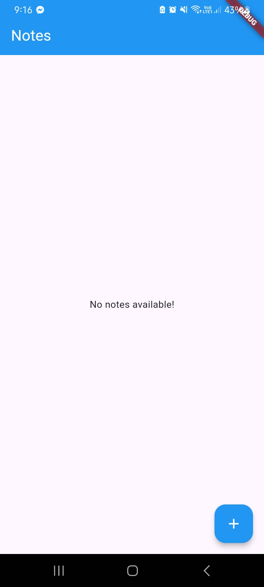
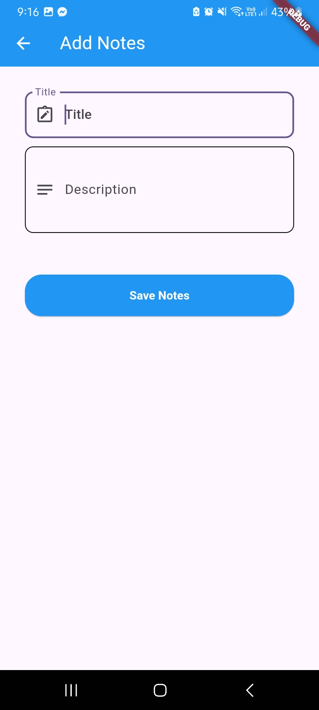
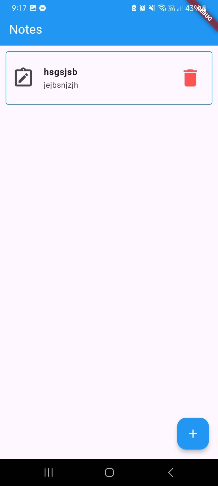
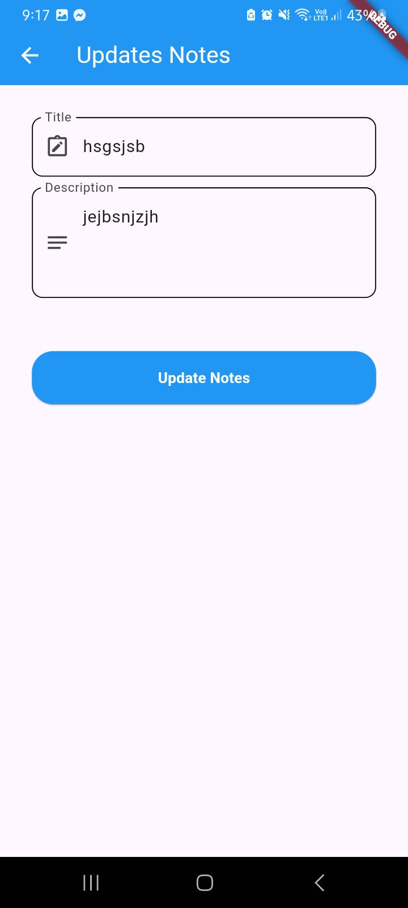
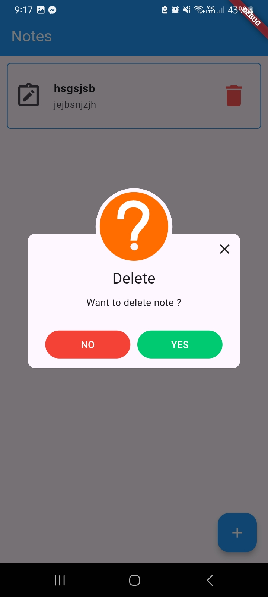

# Flutter SQLite CRUD Notes App

A simple Flutter app for managing notes with SQLite as the local database. This app demonstrates the essential CRUD (Create, Read, Update, Delete) operations on a database and leverages the GetX package for navigation and snackbars.

## Features
Add Notes: Create new notes with a title and description.
View Notes: Display a list of saved notes on the home screen.
Update Notes: Modify the contents of an existing note.
Delete Notes: Remove notes with a confirmation dialog.
Local Storage: Uses SQLite to persist notes data locally on the device.

## Screenshots

Here are some screenshots of the app:

## How to run

1. Clone the repository.
2. Run `flutter pub get` to install dependencies.
3. Use `flutter run` to launch the app.
